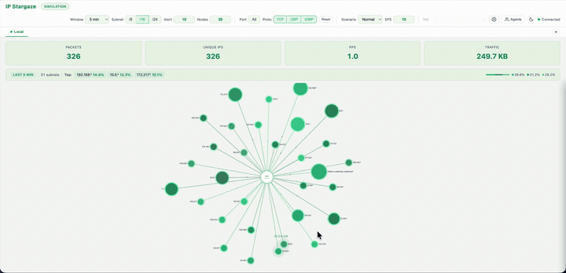

# IP Stargaze

Real-time IP traffic monitoring tool that visualizes network packets as an interactive star graph.

Incoming packets are captured via `tcpdump` (or simulated), classified by subnet, and rendered as a force-directed star graph where node size reflects traffic volume. Supports distributed monitoring across multiple servers via a lightweight agent-collector architecture.

## Demo



## Features

- **Live Capture** - Real-time packet capture via `tcpdump` (sudo required)
- **Simulation Mode** - Built-in traffic generator with Normal / Attack / Scan scenarios
- **Force-Directed Star Graph** - D3.js physics simulation with cluster grouping, pan/zoom, and draggable nodes
- **Distributed Monitoring** - Deploy agents on remote servers, poll via REST API, view each server independently
- **Real-time Dashboard** - Packets, unique IPs, PPS, traffic volume with hover tooltips
- **Subnet Detail Panel** - Click any node to inspect per-IP and per-protocol statistics
- **Alert Effects** - Heartbeat animation and wave ripples on high-PPS nodes
- **Dark / Light Theme** - Two-color palette design with seamless theme switching
- **Configurable** - Time window, subnet level, port/protocol filters, max nodes, alert threshold

## Quick Start

```bash
npm install

# Simulation mode (no root required)
npm run dev

# Live capture mode (requires sudo for tcpdump)
sudo MODE=capture INTERFACE=en0 node src/server/index.js
```

Open **http://localhost:15118** in your browser.

Or use the install script for guided setup:

```bash
bash install.sh          # Interactive (server / agent / both)
```

## Distributed Monitoring

Deploy a lightweight agent on each remote server:

```bash
# On the remote server
AGENT_API_KEY=my-secret-key npm run start:agent
```

Then register the agent from the central server's UI via the **Agents** panel, or use Docker Compose for local testing:

```bash
docker compose up -d    # server + 2 sample agents
```

Agents expose a REST API (`/api/events`, `/api/health`, `/api/info`) with Bearer token authentication. The central server polls agents every 2 seconds and maintains independent aggregators per source.

Switch between sources using the **source tab bar** at the top of the UI.

## Environment Variables

### Server

| Variable | Default | Description |
|----------|---------|-------------|
| `MODE` | `simulation` | `simulation` or `capture` |
| `PORT` | `15118` | Server port |
| `INTERFACE` | `eth0` | Network interface for live capture |
| `EVENTS_PER_SECOND` | `10` | Simulation event rate |

### Agent

| Variable | Default | Description |
|----------|---------|-------------|
| `AGENT_PORT` | `15119` | Agent port |
| `AGENT_API_KEY` | _(none)_ | Bearer token for API authentication |
| `AGENT_MODE` | `simulation` | `simulation` or `capture` |
| `AGENT_INTERFACE` | `eth0` | Network interface for live capture |
| `AGENT_BUFFER_CAPACITY` | `100000` | Event ring buffer size |

## Tech Stack

| Layer | Technology |
|-------|-----------|
| Backend | Node.js 20+, Fastify, @fastify/websocket |
| Frontend | Vanilla JS (ES Modules), D3.js v7 |
| Packet Capture | tcpdump (subprocess) |
| Test | Vitest (98 tests) |
| Container | Docker, Docker Compose |

## Project Structure

```
src/
├── server/
│   ├── index.js                # Server entry point
│   ├── config.js               # Environment config
│   ├── config/constants.js     # Shared constants
│   ├── capture/
│   │   ├── captureManager.js   # Mode switching (simulation/capture)
│   │   ├── simulator.js        # Traffic generator (normal/attack/scan)
│   │   └── pcapCapture.js      # tcpdump-based live capture
│   ├── analysis/
│   │   ├── ipClassifier.js     # IP -> subnet classification (O(1) bitwise)
│   │   └── aggregator.js       # Sliding window aggregation + filters
│   ├── ws/
│   │   ├── wsHandler.js        # WebSocket per-client source routing
│   │   └── messageValidator.js # Message validation
│   └── remote/
│       ├── remoteCollector.js  # Agent polling orchestrator
│       ├── agentConnection.js  # Per-agent connection + health tracking
│       ├── agentStore.js       # Agent CRUD + persistence
│       └── clockSync.js        # RTT-based clock offset correction
├── agent/
│   ├── index.js                # Lightweight Fastify agent server
│   ├── routes.js               # REST API + Bearer auth
│   ├── eventBuffer.js          # Ring buffer (100K events)
│   └── agentConfig.js          # Agent configuration
├── shared/
│   └── protocol.js             # WebSocket message types
└── client/
    ├── index.html
    ├── css/style.css
    ├── assets/favicon.svg
    └── js/
        ├── app.js              # WebSocket client + orchestrator
        ├── starGraph.js        # Star graph module coordinator
        ├── dashboard.js        # Stats cards + info bar
        ├── detailPanel.js      # Subnet detail panel
        ├── agentPanel.js       # Agent management UI
        ├── sourceTabBar.js     # Source tab switching
        ├── config.js           # Visual + PPS config constants
        ├── utils.js            # Color mapping, formatting
        ├── data/               # Graph data management
        ├── simulation/         # D3 force simulation + cluster force
        ├── rendering/          # Node, link, label, hub, cluster renderers
        ├── effects/            # Glow filters, ripple/wave effects
        ├── helpers/            # Theme, highlight, mode helpers
        ├── interaction/        # Drag, tooltip managers
        └── layout/             # Position, zoom managers
```

## Testing

```bash
npm test          # Run all 98 tests
npm run test:watch  # Watch mode
```

## Documentation

- [사용자 매뉴얼 (User Manual)](docs/USER-MANUAL.md)

## License

MIT
